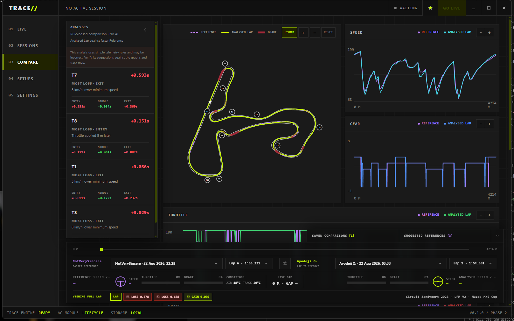
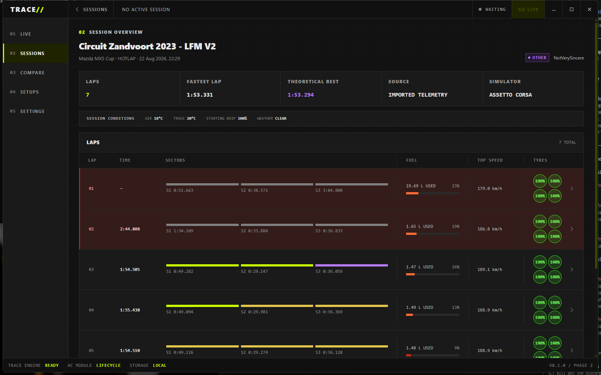
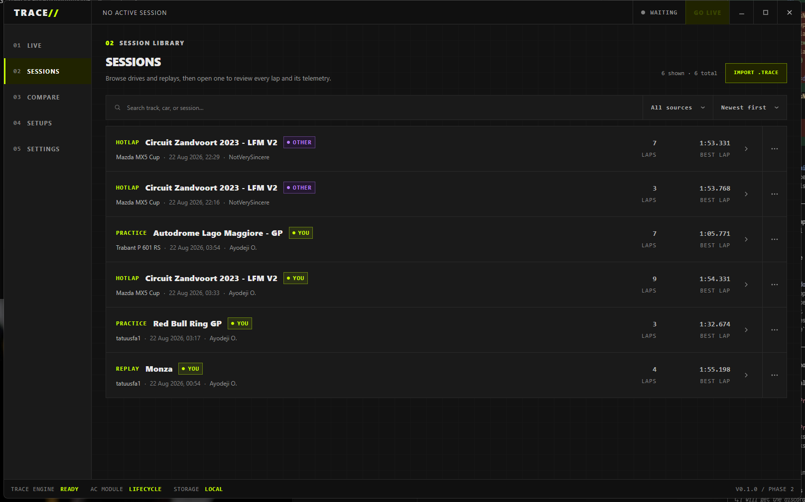

# TRACE

**Find the time.**

TRACE is a local-first, simulator-agnostic motorsport telemetry application for
recording, comparing, and analysing laps. Its purpose is to answer three practical
questions:

- Where am I losing lap time?
- What am I doing differently?
- Is the difference likely to be driving, or could setup and conditions contribute?

Assetto Corsa is the first supported simulator. Independent adapters allow other
simulators to be integrated without coupling the analysis engine to any one game.

> [!IMPORTANT]
> TRACE is being developed with substantial assistance from large language models.
> LLMs are used as software-development tools for research, planning, code generation,
> review, tests, and documentation. Human maintainers direct the project and remain
> responsible for reviewing and accepting changes.

TRACE does **not** use an LLM to produce telemetry conclusions. Normalization, lap
delta, corner analysis, comparisons, confidence, and evidence use deterministic,
tested code.

## Screenshots

### Lap comparison



### Session overview



### Session library



## Documentation

| Document                                                          | Contents                                                         |
| ----------------------------------------------------------------- | ---------------------------------------------------------------- |
| [Documentation index](docs/README.md)                             | Guide to all technical documentation                             |
| [Specification](SPEC.md)                                          | Product and implementation direction                             |
| [Development guide](docs/development.md)                          | Toolchains, commands, repository layout, and troubleshooting     |
| [Architecture review](docs/phase-1-architecture.md)               | Boundaries, dependency rules, risks, and design decisions        |
| [Assetto Corsa integration](docs/assetto-corsa.md)                | Capture boundary, mappings, and known omissions                  |
| [Assetto Corsa API reference](docs/ac-shared-memory-reference.md) | Shared-memory pages, fields, offsets, units, and storage keys    |
| [Corner analysis](docs/corner-analysis.md)                        | Deterministic corner detection and time-loss analysis            |
| [Session package](docs/session-package.md)                        | Portable `.trace` format and import safety limits                |
| [Setup imports](docs/setup-import.md)                             | Simulator-aware setup archive handling                           |
| [MoTeC telemetry import](docs/motec-import.md)                    | CSV import foundations, mappings, and validation requirements    |
| [Live protocol](docs/protocol-v1.md)                              | Versioned live telemetry messages and validation                 |
| [Storage benchmark](docs/storage-benchmark.md)                    | Arrow IPC compression measurements and decisions                 |
| [Contributing](CONTRIBUTING.md)                                   | Change quality, testing, safety, and LLM-assistance expectations |

## Principles

- **Local first:** recording, storage, import, viewing, and analysis must work offline.
- **Simulator agnostic:** simulator-specific data ends at the adapter boundary.
- **Distance aligned:** laps are compared by lap distance, not sample timestamps.
- **Evidence based:** measured facts, derived metrics, heuristics, and uncertainty are
  represented separately.
- **Graceful absence:** missing telemetry channels are normal, not exceptional.
- **Analysis first:** infrastructure and optional features must support the core job
  of finding lap time.

## Architecture

```text
Simulator / Import / Replay
            |
            v
      Simulator Adapter
            |
            v
   Canonical TRACE Domain
            |
            v
       TRACE Core
   deterministic analysis
            |
     +------+------+
     |             |
     v             v
 Desktop UI    Protocol / Web
```

The workspace components are:

| Component             | Responsibility                                                   |
| --------------------- | ---------------------------------------------------------------- |
| `apps/desktop`        | React interface and Tauri application composition                |
| `apps/web`            | Static `simtrace.run` product and download site                  |
| `trace-domain`        | Canonical telemetry, units, capabilities, and session metadata   |
| `trace-adapter`       | Simulator lifecycle and replay-source contracts                  |
| `trace-core`          | Simulator-agnostic telemetry mathematics and structured analysis |
| `trace-recorder`      | Session/lap state and persistence orchestration                  |
| `trace-storage`       | SQLite metadata, Arrow telemetry, and portable session packages  |
| `trace-protocol`      | Bounded live telemetry messages and validation                   |
| `trace-ac`            | Assetto Corsa capture, decoding, and canonical mapping           |
| `trace-windows-shmem` | Audited Win32 shared-memory boundary                             |

`trace-core` must remain independent of Assetto Corsa, Tauri, storage engines,
networking, user interfaces, and LLM providers.

The only crate permitted to contain unsafe Rust is the narrow
`trace-windows-shmem` platform boundary. It owns Win32 handles and volatile copies;
mapped pointers never cross into simulator, domain, analysis, storage, or UI code.

## Install and use

Download the latest Windows installer from [GitHub Releases](https://github.com/keystroke-tools/TRACE/releases/latest).
Install and run TRACE, then start driving or play a replay in Assetto Corsa. TRACE detects
the simulator, records locally, and adds the completed drive to Sessions. Replays must
be played through Assetto Corsa because TRACE records the simulator's live telemetry
rather than parsing replay files directly.

Installed builds check GitHub Releases shortly after startup. When a newer signed
version is available, TRACE offers to download, install, and restart into it. Portable
`trace.exe` builds remain available for diagnostics, but the installer is the supported
path for automatic updates.

The Overlays page previews a resizable pedal-input HUD against generated, live, or
recorded telemetry before opening it as an always-on-top window. Its live graph, pedal
bars, steering display, colours, and background are customisable. TRACE also provides
a local URL for OBS Browser Source capture while the app is running.

## Development

[Mise](https://mise.jdx.dev/) manages the project toolchains. Install Mise, then run:

```sh
mise trust
mise install
mise run install
```

Common commands are:

```sh
mise run format                  # format Rust and frontend sources
mise run check                   # lint, test, type-check, and build
mise run build-windows-desktop   # cross-build trace.exe from Linux/WSL
mise run bench-storage           # compare Arrow codecs
```

See [the development guide](docs/development.md) for native Tauri prerequisites,
focused commands, repository layout, and troubleshooting.

## License

TRACE is available under the [MIT License](LICENSE).
